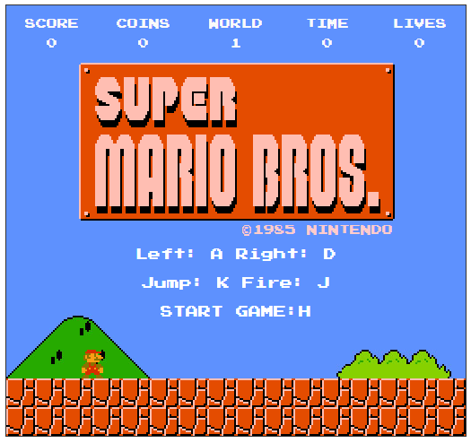
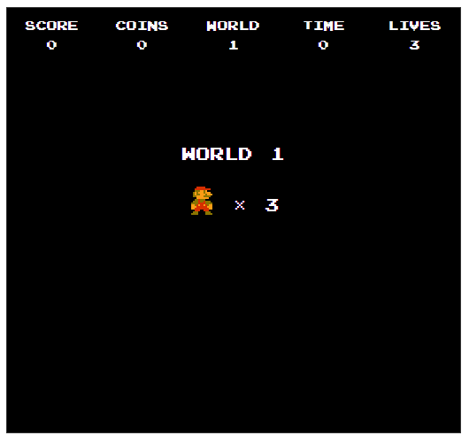
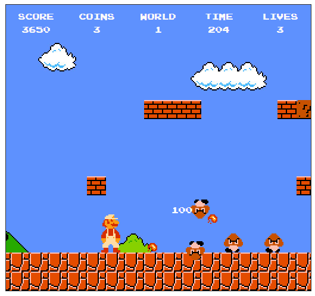
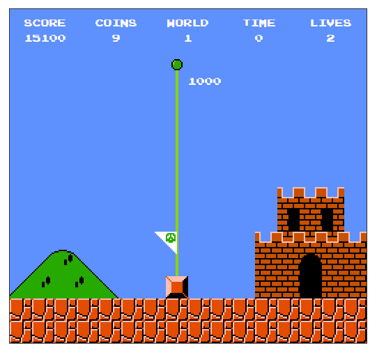

# 超级玛丽

## 前言

如果你没有玩过《超级玛丽》这个游戏，我真不敢想像你的童年是什么颜色的。曾经因为它，不知道挨了老妈多少顿打，有时连饭都顾不上吃。记得上初中那年，老妈终于同意给我买了个小霸王，但是因为当时是走读，一个星期才能回一次家。而当我第二个星期回家的时候，小弟弟用委屈的眼神看着我说：哥，你的学习机不知道为什么接电视机上没反应了。。接电视机上没反应了。。。没反应了！当时我那个恨啊！

## 游戏介绍

通过 A D 键来控制角色左右移动，K键跳，吃到子弹时使用J键射击，按H键开始游戏。游戏还是以背景运动的方式来实现人物向前跑的效果。其中主要运用了碰撞检测、抛物线运动等算法，并对大量的数据进行了分组处理。是否真实还原了游戏，由你来体验并给出答案。 当然，游戏中有些地方在操作控制上稍微有些不足，有待进一步完善。目前只有一关。

## 主要功能

- **游戏地图的创建**： 地图的样式展现，陆地，石头，管道，岩石，带属性硬石，碉堡，城堡岩，旗帜，旗杆等。

- **游戏关卡的设置**：障碍物、玛丽奥、敌人、隐藏物等位置属性。

- **玛丽奥的功能设置**：实现定位、缓动效果移动、跳跃、成长、降级、发射子弹、死亡和障碍物及敌人碰撞检测。

- **敌人的功能设置**：实现定位、移动、死亡、飞分数和障碍物及玛丽奥碰撞检测。

- **障碍物的设置**：实现定位、实现碎石、飞金币、长蘑菇、飞分数、移动等效果、隐藏物的展现和玛丽奥的碰撞检测。

- **属性物的设置**：子弹，成长蘑菇，加人蘑菇，子弹花，金币的属性设置及功能实现。

- **游戏数据的展示**：游戏开始、开始关卡、游戏结束界面数据展示，游戏进行中展现倒计时、分数、金币、关卡、生命等数据。